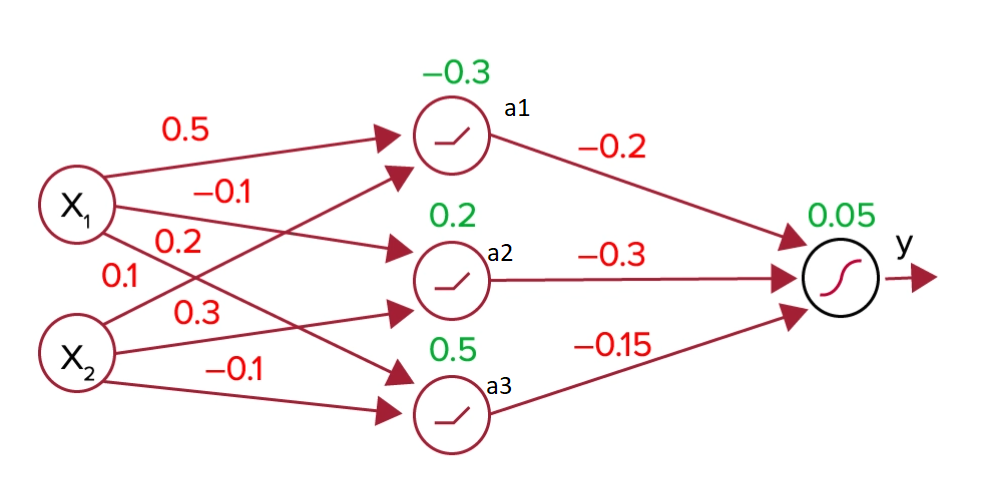

# 🧠 Neural Network from Scratch – Iris Classification

This project demonstrates a 2-layer feedforward neural network implemented entirely from scratch using **NumPy**, without using any ML libraries like TensorFlow or PyTorch. The model is trained to classify **Iris flower species** using standard backpropagation and gradient descent.

---

## 📌 Architecture

The model consists of:
- Input Layer → Hidden Layer (ReLU) → Output Layer (Softmax)
- Manual forward pass and backward propagation
- Training with categorical cross-entropy loss

  

---

## 🧠 Architecture

  

## 📂 Project Structure

- `FlexibleNN`: Modular neural network class with customizable layers
- `train_scratch.py`: End-to-end training loop using NumPy
- `train_tensorflow.py`: Equivalent TensorFlow model for validation
- `utils.py`: Common helper functions for loss, metrics, preprocessing

---

## 🔬 Dataset

- Source: `sklearn.datasets.load_iris()`
- Inputs: 4 numerical features – sepal length/width, petal length/width
- Outputs: 3 classes – Setosa, Versicolor, Virginica
- Train/test split with stratified sampling
- Features standardized using `StandardScaler`

---

## ✅ Results

| Model           | Accuracy |
|----------------|----------|
| Scratch NN      | ~95%     |
| TensorFlow (Ref)| ~96%     |

The scratch model achieves comparable performance with TensorFlow’s implementation, validating the backpropagation logic.

---

## 🧠 Key Learnings

- Building ReLU + Softmax pipelines manually
- Deriving and vectorizing gradients for backpropagation
- Understanding the role of activation functions in training
- Tuning initialization, learning rate, and batch sizes

---

## 🚀 Future Improvements

- Add batch training support
- Integrate learning rate decay
- Visualize loss and accuracy trends over epochs

---

## 📎 References

- Andrew Ng’s Deep Learning Specialization
- MIT Deep Learning Notes (6.S191)
- CS231n: Neural Networks Module

---

Feel free to fork, star ⭐, or contribute! This is a foundational hands-on learning project for deep learning enthusiasts.
